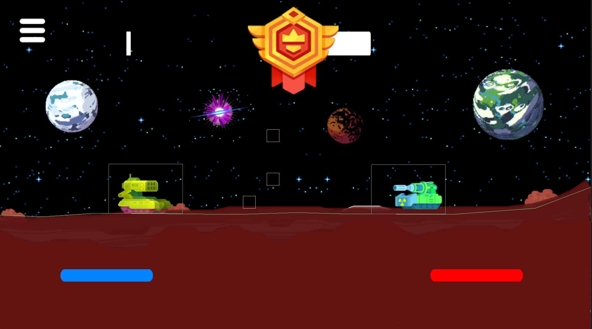

# Tank-Stars

A game inspired by the mobile game *Tank Stars*, designed for PC. Written in Java using LibGDX.  

# [Click here to watch the demo video!](https://youtu.be/py3xkiW2f80)

# [Click here to watch the demo video!](https://youtu.be/py3xkiW2f80)

## How to run

- Clone the repository: `git clone https://github.com/Zynade/Tank-Stars.git`
- cd into the directory: `cd Tank-Stars`
- Run the game: `./gradlew desktop:run`
- Enjoy!

Note: You will need the Java Development Kit to run the game.
If you get the error `./gradlew: command not found`, use the following command:  
`chmod +x gradlew`

### Please press **Space** to get past the splash screen

## How to play

- Player one:
  - Move left: **A**
  - Move right: **D**
  - Shoot: **G**
  
- Player two:
  - Move left: **left arrow key**
  - Move right: **right arrow key**
  - Shoot: **space**

- Pause menu: **P**

Hold shoot to power your shot. The longer you hold, the more powerful your shot will be.

Each player gets a limited supply of fuel. If you run out of fuel, you will be unable to move.
Your fuel will be automatically refilled at your next turn.

You can save game progress by going to the pause menu (**P**) and clicking **Save**. You can load your save file by going to Player > Resume > Slot 1.

## Disclaimer

This game is not affiliated with the original game in any way. All rights belong to their respective owners.
This clone is made for educational purposes only.

This project was made by [Atharv Goel](https://github.com/Zynade) and [Sameer Gupta](https://github.com/guptasameer112) for their *CSE201: Advanced Programming* course at IIIT Delhi.
